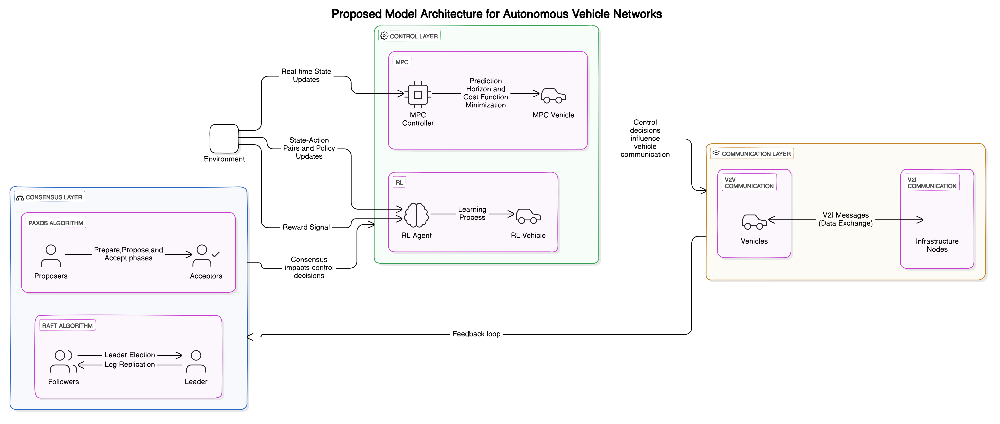
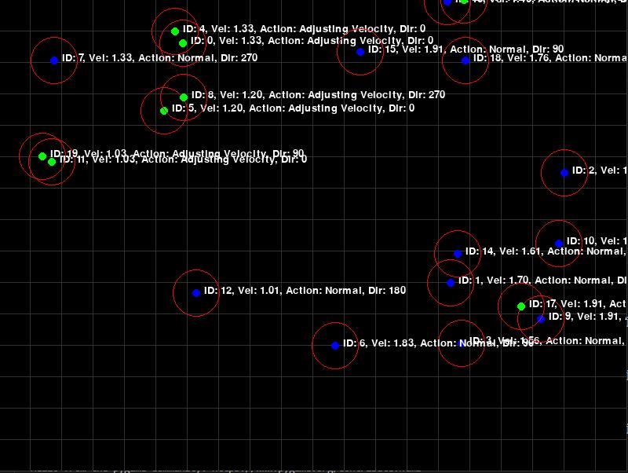

# Decentralized Consensus and Control for Autonomous Vehicles - Simulation Implementation

This project implements a simulation of autonomous vehicles using decentralized consensus and control strategies. The simulation is based on concepts presented in the **conference paper**:

**"Decentralized Consensus and Control for Autonomous Vehicles"** 
Presented at **WPMC 24 IEEE at Sharda University**.

## Features
- **Autonomous Vehicle Simulation**: Models vehicle movement, decision-making, and interaction.
- **Decentralized Consensus (Paxos-like Algorithm)**: Vehicles communicate and adjust their velocity based on nearby vehicles.
- **Model Predictive Control (MPC)**: Adjusts vehicle velocity to minimize deviation.
- **Reinforcement Learning (RL) Adaptation**: Simple RL-based mechanism for vehicle velocity tuning.
- **Proximity-Based Communication**: Vehicles detect and interact with nearby vehicles.
- **Grid Road Network**: Simulates vehicle movement on a structured road system.
- **Data Logging & Visualization**: Logs vehicle velocity over time and visualizes changes.

## Simulation Overview
- **Input**: A grid-based road network with multiple autonomous vehicles.
- **Processing**: Vehicles move, detect nearby vehicles, and adjust their velocities based on consensus and control algorithms.
- **Output**: Simulated behavior of autonomous vehicles with real-time visualization.

## Installation
### Prerequisites
Ensure you have the required dependencies installed:
```sh
pip install numpy pandas pygame matplotlib
```

### Clone the Repository
```sh
git clone https://github.com/sachinsonii/DCC-AV_Simulation.git
cd DCC-AV_Simulation
```

## Running the Simulation
To start the simulation, run:
```sh
python simulation.py
```
This will:
1. Initialize the grid-based road network.
2. Spawn autonomous vehicles with random initial velocities.
3. Apply decentralized consensus, MPC, and RL strategies.
4. Visualize vehicle movement in real time.
5. Log and plot velocity changes over time.

## Visualization & Results
- **Block Diagram**: Explains the decentralized consensus and control system used in the simulation.
  

- **Simulation Demo Video**: Demonstrates the working of the simulation.
  

- **Conference Presentation (PPT)**: The presentation slides from the conference.
  

## Future Improvements
- Implement more advanced RL techniques for adaptive velocity control.
- Integrate obstacle detection and lane-changing behavior.
- Extend the simulation to a 3D environment.

## License
This project is licensed under the MIT License.

## Author
Developed as part of the conference paper **"Decentralized Consensus and Control for Autonomous Vehicles"** 
Presented at **WPMC 24 IEEE at Sharda University**.

For inquiries, contact [your-email@example.com].

